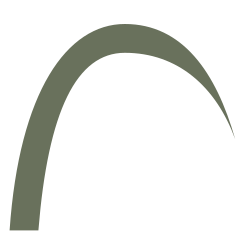
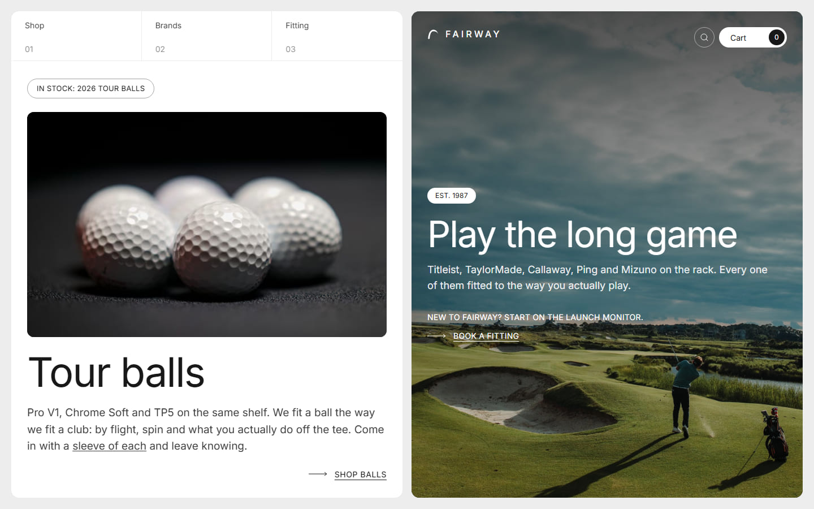
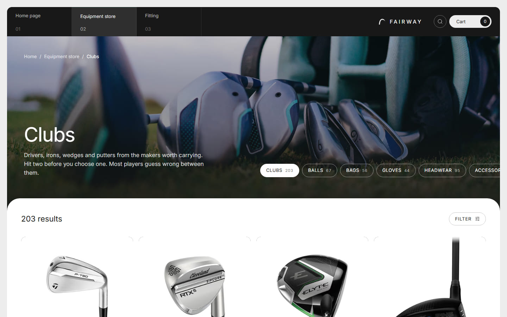
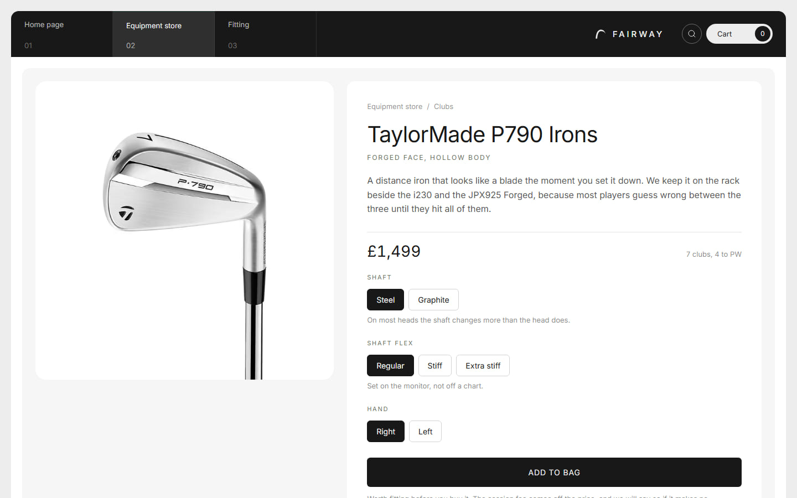
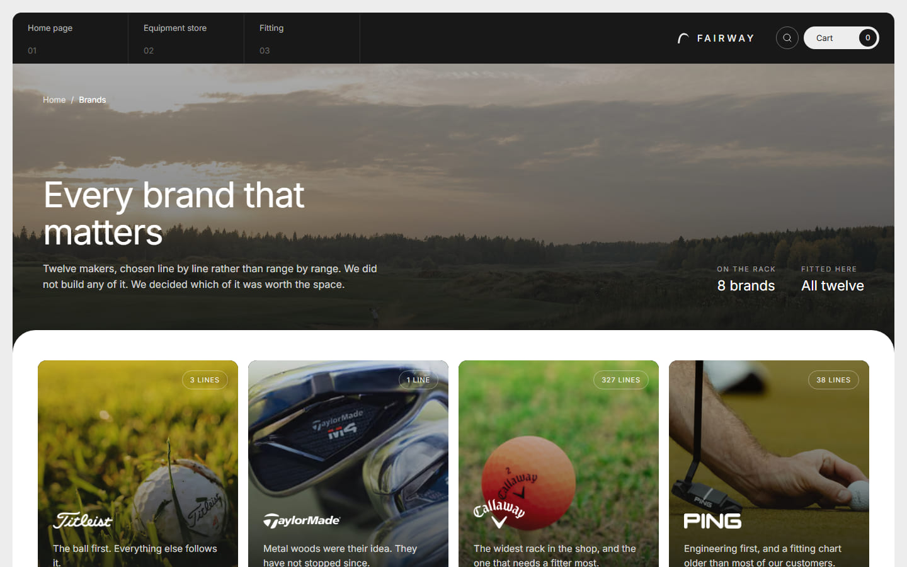

<p align="center">
  
</p>

<h1 align="center">FAIRWAY</h1>

<p align="center"><strong>Every brand that matters. Fitted to the way you play.</strong></p>

A multi brand golf equipment retailer, built as a design and engineering project. FAIRWAY is a
fictional shop near St. Andrews with a fitting studio at its centre: it does not make clubs, it
chooses them. The whole site is written from that position, which is a different voice from a
manufacturer's and a different information architecture from a marketplace.

> Live: <https://fairway-shop.vercel.app> · Repository: <https://github.com/Biplo12/fairway>

---

## What it is

A full storefront for a shop that sells real, recognisable equipment: Titleist, TaylorMade,
Callaway, Ping, Mizuno, Srixon, Cleveland, Odyssey and the rest. Nothing here implies a
partnership, an endorsement or an affiliation with any of them.

| What | How much |
| --- | --- |
| Products | 515, across 8 brands with stock and 4 more to order |
| Categories | clubs (203), headwear (95), balls (67), bags (56), accessories (50), gloves (44) |
| Club types | irons 63, wedges 34, fairway woods 34, putters 26, drivers 23, hybrids 23 |
| Routes | 17 patterns, of which 515 product pages and 12 brand pages prerender at build |
| Photographs | 1299 files, manufacturer packshots plus editorial stock |



| The clubs shelf, 203 lines behind one filter | A product page, options read from the spec |
| --- | --- |
|  |  |



## Why it is built this way

**The shop chose these clubs, it did not build them.** Every line of copy follows from that. A
maker writes "we spent two years refining the sole geometry". A fitter writes "three shafts in the
same head, and the difference is eleven yards of dispersion". The second one is the whole project.

**Products are data, never repeated markup.** `src/content/products.ts` is a typed module and the
brand is a first class field, so it drives the shelves, the filters, the brand index and the card.
The shop renders from that list; there is no CMS and no hard coded product card anywhere.

**Real products, photographed properly.** Generating own brand equipment convincingly is not
possible, so the catalogue carries manufacturer packshots and the editorial frames come from stock
photography, downscaled from large originals with `lanczos3` and a light unsharp pass. Every image
is sharp at a 2x device pixel ratio, and nothing is ever upscaled.

**Server first.** Server components by default, client components only where interaction demands
one: the bag, the lens on a product photograph, the navigation, the two forms. The filters are
plain links, so every shelf has its own address and a customer can send somebody the exact view
they are looking at.

## The interesting parts

- **`src/content/products.ts`** the catalogue, plus the derived helpers the shop reads: shelves,
  club types, price bands, sorting, search and related products.
- **`src/content/product-copy.ts`** generated product pages. Writing 515 bespoke pages would mean
  inventing lofts and weights for real clubs, so the generator builds a page from the category, the
  subcategory and the model's own tokens, and 159 pages are hand written on top of it.
- **`src/content/product-options.ts`** shaft, flex, loft and length options read out of the
  product's own spec line rather than invented.
- **`src/components/cart/cart-context`** the bag keys a line by slug plus chosen options, so the
  same head in two shafts is two lines rather than a quantity of two.
- **`src/components/ui/lens`** the zoom on a product photograph: a pointer following transform
  origin and a minimap in the corner, on the product page only.
- **`src/app/not-found.tsx`** a 404 that is a way back to the rack rather than an apology: the
  search box, every shelf with its count, and four things actually in stock.

## Running it

```bash
npm install
npm run dev
```

Then open <http://localhost:3000>.

```bash
npm run build     # production build, prerenders every product page
npm run lint      # eslint
npx tsc --noEmit  # types
```

## Stack

Next.js 16 (App Router) · React 19 · TypeScript strict · Tailwind CSS v4 with CSS first tokens ·
`lucide-react` · `clsx` and `tailwind-merge`. No component library: the bento card language is hand
built. No CMS: content lives in typed modules under `src/content`.

## Design

Full bleed cards on a neutral grey page, 12px to 20px gutters, media rounded to 20px and cards to
14px. Inter carries everything, uppercase and letter spaced for labels, tight negative tracking for
headlines. Photography does the talking and the interface stays muted: off white `#EDEDED`, paper
`#F6F6F6`, charcoal `#171817`, forest `#26352D`, olive `#69715C`.

Interaction is deliberately small: image scale on hover, arrow translation, an underline, a
staggered entrance. All of it is cancelled under `prefers-reduced-motion`.

`CLAUDE.md` in the repository root is the single source of truth for brand, art direction and
structure, and is worth reading before changing anything visual.

## Honest notes

- FAIRWAY is fictional. Nothing typed into the site is sent anywhere, no order is dispatched and no
  payment is taken. The booking and contact forms confirm on the client and keep nothing.
- Product names and packshots belong to their makers. They appear here the way they would appear in
  a retailer's catalogue, and the shop's own identity is never printed onto them.
- Vokey, Scotty Cameron, FootJoy and Sun Mountain have no stock lines in the catalogue, so they are
  marked "to order" on the brand index. Their cards carry a photograph rather than their own
  product, because no photograph of their equipment was obtainable for this project.

## Licence

A portfolio piece. The code is free to read and learn from. The photography and the brand names in
it are not mine to license.
